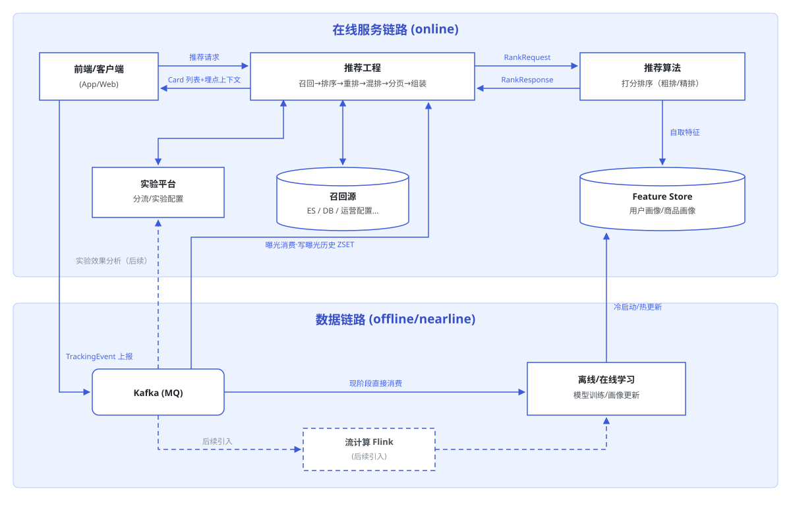

# HLD of Reco System

> 原页：https://app.notion.com/p/3a6128bc62c6812aab4bf5cf5035bd78 ，最后编辑 2026-07-28，导出 2026-09-18。
> HLD (what + why)：背景介绍、名词解释、整体架构、边界契约和关键决策。LLD (how)：实现细节、pros and cons、trade off。

## 背景介绍

BNTO 要搭建 reco 2.0。首批落地两个场景：**PLP 商品列表页、Feed 个性化信息流**。这两个场景性质不同，但都可以架在同一套推荐流程上：底层是一套相对固定的流程编排（召回 → 排序 → 重排 → 混排 → 分页 → 组装 → 曝光），上层根据不同业务场景，接入不同的数据源和策略。

- PLP：分类或搜索的商品列表页，有一个**事先框定好的商品池**，我们要做的是对这个固定的池子做**重排序**，以提高 CTR / 转化率等指标。
- Feed：个性化信息流，可能出现商品、looks、collections、survey、订阅、活动、广告、优惠券等多种物料，是一个异构的无限流。

## 名词解释

- **物料 (card)**：信息流里展示的一个条目，可能是商品，也可能是 looks、订阅、活动、优惠券等。
- **召回（recall）**：从各数据源把"可能要展示的候选"捞出来的过程。多路召回并行，结果合并成一个候选集。
- **排序（rank）**：对候选集打分并排序，决定谁排前面。这是算法模型介入的主要环节，按模型轻重分为粗排、精排两层，两者都由算法实现。
  - **粗排（pre-ranking）**：候选集过大、精排算不过来时，先用一个轻量模型（如双塔）把候选快速筛小（如几万 → 几千），是精排前的算力漏斗，牺牲一点精度换吞吐。（对于候选集不大的池子可以先不做，直接用精排即可）
  - **精排（fine-ranking）**：用重模型（丰富特征、交叉特征）对候选精细打分，决定最终顺序，是排序的主环节。
- **重排（re-rank）**：排序之后，根据业务规则对结果做调整（过滤、打散、置顶等）。这部分是规则，不进模型。
- **混排（blending）**：把商品和非商品物料（looks、活动等）按规则/策略，混合插入到同一个信息流里。
- **分页（pagination）**：把排好序、混好排的完整列表按页返回给前端，而不是一次性全给。
- **组装（assembly）**：算法只给 type + id，工程按 type 用对应的 CardFiller 把展示字段填进 data，拼成前端要的 Card。组装在分页之后，只组装当前页要返回的物料。
- **曝光（impression）**：物料真正展示给用户。曝光行为（看到、点击、转化）由客户端采集上报，用于效果统计和 Feed 的跨页去重。

## 整体架构



（SVG 源文件从 2026-07-27 上传 Notion 的附件中恢复。）

## 与前端和客户端的契约

### 物料结构

所有推荐系统返回给前端用于展示的元素，放到一个统一的 `Card` 结构中：

```javascript
class Card <T> {
    type;  // 卡片类型，前端据此决定用哪个组件渲染
    id;    // 该物料在其类型下的唯一标识 （type + id 构成 unique key)
    data;  // 该 type 的展示字段，用泛型承载——不同 type 对应不同的 data 结构
}

// product card
{
  "type": "product",
  "id": "sp_10086",
  "data": {
    "title": "Wool Blend Coat",
    "coverImage": "https://.../coat.jpg",
    "price": 12900
  }
}

// look card
{
  "type": "look",
  "id": "look_233",
  "data": {
    "coverImage": "https://.../look.jpg",
    "productCount": 5
  }
}
```

- 这套信封是页面无关的：PLP 和 Feed 以及以后任何类似的推荐列表页，都复用同一套；
- 算法侧只产出 `type + id`（它不关心怎么展示），工程侧按 type 用对应的 CardFiller 把展示需要的字段重新填进 `data`，再返回前端。前端按 type 分支渲染，遇到不认识的 type 直接跳过——这样后端上线新的卡片类型时，老版本 App 不会崩，只是不展示这种新卡（前向兼容）。

### 分页机制

子页：[分页方法（offset 与 cursor）](reco-pagination-offset-vs-cursor.md)

**PLP 与 Feed 统一：无限下拉流 + cursor based pagination。** 两个场景都以无限下拉的流呈现，分页统一用 cursor——由服务端控制的不透明令牌，编码"从哪里继续"，前端只负责原样带回，不解析、不拼接。

- Feed：内容是动态的，翻页期间池子还在变（新召回进来、已曝光的下沉），offset 在动态列表上会漏项或重复；cursor 天然适配"只往下滚、且要跨页去重"的场景；
- PLP：固定池上 cursor 同样成立（令牌编码池内续接位置）；且统一后 PLP 后续引入动态性（新品插入、售罄下沉）时契约不用变；
- 统一的收益：前端只维护一套滚动加载逻辑，服务端只维护一套分页协议；无限流不需要页码导航，响应不提供 total / 总页数；
- 请求侧参数：`cursor`（首页不带或为 null）+ `pageSize`；翻页时原样带回上一响应的 `nextCursor`。

### 埋点曝光

- 整体方案：曝光、点击、转化等都由客户端采集上报，服务端不参与。
  - "服务端返回了" ≠ "用户看到 / 点击 / 购买了"，曝光与行为的事实只有客户端知道；
  - 单一上报通道，口径统一，不会出现两份对不上的日志。
- 埋点内容：按归属分五组，后续用几个子对象分别装（request / user / experiment / item / event），组装成一个埋点大对象 `TrackingEvent`：

| 分组 | 字段 | 说明 | 来源 |
|---|---|---|---|
| 请求信息 request | `request_id` | 一次推荐请求的唯一 ID，串联曝光→点击→转化，也与服务端全链路日志对齐 | 服务端下发 |
| | `page_name` | 行为发生的场景：home_feed / plp 等 | 客户端已有 |
| 用户信息 user | `user_id` / `device_id` | 用户与设备标识（未登录时只有 device_id） | 客户端已有 |
| | `platform` | iOS / web | 客户端已有 |
| 实验信息 experiment | `exp_group` | 用户所处的实验分组，效果归因用 | 服务端下发 |
| | `algo_version` | 算法策略版本号，效果归因用 | 服务端下发 |
| 物料信息 card | `type` / `id` | 卡片类型与标识；商品卡时 id 即 product_id，非商品卡复用同一套字段 | 服务端下发 |
| | `position` | 卡片的坑位序号。位次由服务端混排后决定，客户端自己数不可靠，必须下发 | 服务端下发 |
| 事件信息 event | `event_type` | 曝光 / 点击 / 收藏 / 下单等 | 客户端产生 |
| | `event_time` | 行为发生的时间戳 | 客户端产生 |

- Notes:
  - 服务端下发的部分随卡片返回，客户端上报任何事件时原样带回（只透传，不解析）；
  - 下发的埋点内容不携带敏感内部信息，`exp_group` 等用中性编号命名不暴露实验意图；
  - 事件的完整定义（可视曝光阈值等）与防作弊去重规则见 BNTO-7498。
  - 后记（代码实现时的修订，2026-08-06）：`algo_version` 和 `position` 最终未下发，tracking 块只有 `request_id` + `exp_group`；position 由客户端按渲染顺序计数。

### 请求示例

PLP 与 Feed 共用同一套请求参数（`cursor` + `pageSize`）；差别只在 PLP 额外携带池子查询条件（userId / deviceId 走鉴权头 / 公共参数，不在 body）：

```javascript
// 首页：不带 cursor（示例为 Feed）
{ "pageSize": 10 }

// 翻页：原样带回上一响应的 nextCursor
{ "pageSize": 10, "cursor": "eyJvIjoyMCwidCI6MTcyfQ" }

// PLP 与 Feed 的唯一差异：PLP 额外携带池子查询条件
{ "pageSize": 10, "poolQuery": { /* 沿用现有 PLP 列表接口的查询字段，具体以前后端对齐为准 */ } }
```

### 返回示例

PLP 与 Feed 共用同一套响应外壳（`cards` + `nextCursor`），卡片信封与埋点上下文也一致；差别只在 cards 的内容——PLP 是同构数据（全部 product 卡），Feed 是异构数据（product / look / … 混排）：

```javascript
{
  "cards": [
    {
      "type": "product",
      "id": "sp_10086",
      "data": { "title": "Wool Blend Coat", "coverImage": "https://.../coat.jpg", "price": 12900 },
      "tracking": { "request_id": "r-8f3a", "exp_group": "e102_b", "algo_version": "rank_v1", "position": 0 }
    },
    {
      "type": "look",
      "id": "look_233",
      "data": { "coverImage": "https://.../look.jpg", "productCount": 5 },
      "tracking": { "request_id": "r-8f3a", "exp_group": "e102_b", "algo_version": "rank_v1", "position": 1 }
    }
  ],
  "nextCursor": "eyJvIjoyMCwidCI6MTcyfQ"  // 服务端控制的不透明令牌；null = 没有更多
}
```

## 与算法的边界和契约

整体流程：召回 → 排序 → 重排 → 混排 → 分页 → 组装 → 曝光。

- 算法：只负责排序。接收候选集（type + id + sources）与 context（user、scene 等），自取特征，模型打分，输出排序结果。
- 工程：负责召回、重排、混排、分页、组装、曝光等流程中的其他环节。

之所以召回归工程：数据源接入（OpenSearch、运营配置、looks 库等）、上架/库存/合规过滤、池子框定，这些本就是工程的既有能力和业务约束，且变动频繁，不该塞进模型。

### 排序契约（rank IO）

工程调用算法排序，一进一出：

**RankRequest**

| 字段 | 说明 |
|---|---|
| `requestId` | 本次推荐请求的唯一标识，贯穿全链路，用于日志串联和问题排查 |
| `scene` | 场景（PLP / Feed），算法据此选用对应的模型/策略 |
| `variant` | 实验分组信息，算法据此走对应的实验策略，也用于效果归因 |
| `userId` / `deviceId` | 用户标识（未登录时只有 deviceId），算法取用户侧特征的 key |
| `candidates[]` | 候选集，每条 = `type + id + sources`（sources：该候选由哪几路召回产生） |

**RankResponse**

| 字段 | 说明 |
|---|---|
| `candidates[]` | 排序后的候选集，每条 = `type + id + score（可选）`，顺序即结论；score 是该候选的模型分，仅供调试与日志，工程逻辑不依赖它 |

Notes：

- **请求里不带特征。** 算法拿到 `id`（userId, deviceId, productId, etc.）后自己去特征存储取打分所需的特征。特征体系归算法自己演进：加特征、换特征不需要改工程代码、不需要动这份契约。
- **候选带 `sources`。** 一个候选可能同时被多路召回命中，哪几路命中本身就是打分的有效信号，也是排序之外唯一由工程透传给算法的信息。
- **排序是全量进、全量出。** 工程把合并后的候选集整体交给算法，拿回完整的有序列表，之后的重排、混排、分页都在工程侧做——算法不感知分页。
- **降级：** 算法超时或失败时，工程按召回结果的默认顺序兜底返回，不阻塞请求。

## LLD

- [LLD of Reco Pipeline (online)](reco-lld-online.md)
- LLD of Tracking Event (offline)：Notion 页已清空，内容并入在线 LLD Part 3 归因闭环。
