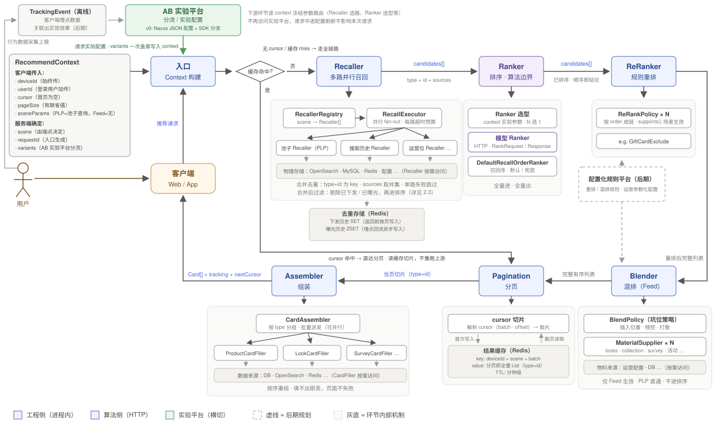

# LLD of Reco Pipeline (online)

> 原页：https://app.notion.com/p/3a7128bc62c6816ea66ecdac482cc40f ，最后编辑 2026-08-06，导出 2026-09-18。冻结于 2026-07-30，2.3 存储选型于 2026-08-06 重开一次（BF → ZSET）。

# 0-Overview



（SVG 源文件从 2026-08-06 最后一次上传 Notion 的附件中恢复，含 ZSET 去重存储框。）

- 本文按 pipeline 的三个组成部分展开：
  1. 主流程：一次请求的完整链路与各环节设计
  2. 分页、缓存与去重：cursor 分页、结果缓存、Feed 去重
  3. AB 实验：分流与实验效果对比分析

# 1-主流程

## 1.0 整体流程

- 设计原则：
  - **编排固定**：环节顺序写死在代码里，不做动态编排；场景差异由各环节的实现选择表达（Recaller 选路、Ranker 排序、Rerank / Blender 策略等）；
  - **全流程数据传递轻量化**：召回到分页之间 candidate 只携带 type+id，完整卡片数据在出页前由 CardFiller 按当页切片回填；
- 两条链路：
  - 全链路（缓存未命中）：入口构建 RecommendContext → Recaller 多路并行召回 → Ranker 排序 → ReRanker 规则重排 → Blender 混排 → Pagination 分页 → Assembler 组装 → 返回客户端；
  - 快路径（缓存命中）：cursor 命中结果缓存时直达 Pagination，读缓存切片后组装返回，不重跑"召回→排序→重排→混排"等主链路节点；

## 1.1 Context 构建

- 角色定位：在进入 Pipeline 之前根据用户请求和端点构建 context；
- 字段说明：
  - 客户端传入：deviceId / userId（deviceId 始终传，登录用户加传 userId）、cursor（第一次请求为空）、pageSize（有缺省值）、sceneParams（单个不透明对象，框架不读取；PLP 入口放入池子查询条件、池子 Recaller 取出使用，Feed 暂无）；
  - 服务端确定：scene（由端点决定，客户端不传）、requestId（入口生成）、variants（AB 实验平台分流结果，入口一次盖章写入 context，下游只读冻结参数路由）；

## 1.2 Recaller（召回）

- 角色定位：逻辑召回单元，按需访问物理存储，多路并行召回；
- 运行机制：
  - 实现：SPI (Service Provider Interface)，一路召回 = 一个实现；
  - 注册：RecallerRegistry 维护 scene → Recaller[] 的注册关系；
  - 选路：注册名单 与 实验名单 取交集；
  - 执行：RecallExecutor 将生效名单并行执行，每路独立超时预算，单路失败/超时跳过该路，不影响其余路；
  - 合并：以 type+id 为 key 合并各路结果，sources 取并集（候选命中的召回名单，随 candidate 传给 Ranker 作为算法的参考）；
  - 过滤：合并后经去重（见 2.3）过滤再进排序；
- 业务场景：
  - PLP 只注册池子 Recaller（按 sceneParams 中的池子查询取全量）；
  - Feed 注册多路（搜索历史、运营位等）。

## 1.3 Ranker（排序）

- 角色定位：全链路唯一的算法边界，全量 candidates 进、全量排序后出，顺序即排序结论；
- 运行机制：
  - 根据 context 中的 variants 实验参数选取对应的 Ranker 模型；
  - 通过 HTTP 调用相应的 Ranker 模型（Python 算法服务）完成排序；
    - 调用 HTTP 的 payload 只带身份信息（userId + candidates 的 type+id + sources），不传特征与大对象，特征由算法侧自取；
    - 超时 / 失败 / 降级 时用 DefaultRecallOrderRanker：按召回序返回，默认实现，也是兜底；
    - 用 HTTP 而非 RPC 受当前基建限制，identity-only payload 下影响可接受（若候选量达到粗排规模，先做预排序缩量，再考虑换协议）；
- 业务场景：PLP 和 Feed 均生效。

## 1.4 ReRanker（重排）

- 角色定位：对 Ranker 的排序结论做业务规则修正（过滤、打散、置顶），**纯序变换**——只调整商品序，不引入新物料，数量只减不增；
- 运行机制：
  - 实现：SPI (Service Provider Interface)，一条规则 = 一个 ReRankPolicy 实现（如 GiftCardExclude）；
  - 执行：所有规则按 order 排成链依次执行，每条规则以 supports(scene) 声明生效场景；
- 阶段演进：
  - v0：规则集与参数写死在代码里，新增规则走发版；
  - v1：如果需要频繁更新规则参数，可将开关/阈值/顺序外置 Nacos（热更新 + 请求内冻结），每种规则 = policy 代码实现 + 配置实例；
  - v2：当运营改规则的频率高到找工程成为瓶颈时，可进一步升级为 **配置化规则平台**（运营 UI、规则实例 CRUD、审批/灰度），可在 v1 "policy 代码实现 + 配置实例"的基础上由运营组合参数化的既有规则类型，也可进一步升级成 DSL；
- 业务场景：PLP 和 Feed 均生效。

## 1.5 Blender（混排）

- 角色定位：将非商品物料（looks / collection / survey / 活动 / 广告等）按坑位规则插入排序后的商品流，是**合流**而非序变换——引入召回排序之外的新物料，改变流的组成；
- 运行机制：
  - 取料：MaterialSupplier × N，每类物料一个实现，按需访问运营配置 / DB；
  - 插坑：BlendPolicy 决定插入位置、频控、打散；
  - 区分：运营位 Recaller 召回的是商品（进排序），Blender 的运营物料是非商品卡片（不进排序）；
  - 与 ReRanker 的关系：同属业务规则、可与 ReRanker 共用一个规则平台，但操作对象不同（ReRanker 是序变换 / Blender 是合流）。
- 业务场景：
  - PLP：直通，跳过此环节；
  - Feed：生效，异构卡片全部由此进入流；

## 1.6 Pagination（分页）/ Cache（缓存）

- 角色定位：把分页前的完整有序列表 batch（定义见 2.1）整体写入缓存、按 cursor 切片下发，让翻页变成读缓存不重跑上游；
- 运行机制：
  - 缓存点：混排后、分页前，完整有序 List（type+id）整体写入结果缓存；
  - 首次请求（无 cursor）：跑全链路生成 batch，分页前写缓存，返回首页切片 + nextCursor；
  - 翻页（cursor 命中）：凭 cursor 直接读缓存取片，不重跑上游，不调算法；
  - miss / 过期：按新 batch 处理，重跑全链路；
- 业务场景：
  - PLP：无混排，缓存的是重排后的商品快照，miss 即重建快照；
  - Feed：缓存的是混排后的异构流，miss 即自然刷新出新 batch；
- 详细设计：2-分页、缓存与去重。

## 1.7 Assembler（组装）

- 角色定位：将当页切片（type+id）回填成完整 Card，是"全流程数据传递轻量化"的出页还原点；
- 运行机制：
  - 分组派发：CardAssembler 按 type 分组，批量派发对应 CardFiller（ProductCardFiller / LookCardFiller / SurveyCardFiller …）；
  - 数据回填：每类 filler 按需访问数据源（DB / OpenSearch / Redis），批量查询展示字段；
  - 重组：按切片原序重组，填不出即丢（下架、删除等），页面不失败；
  - 串行执行：数据量是页级的，性能来自按 type 批量而非并行，不做也不规划并行化；
- 业务场景：
  - PLP：单 type（product），一次批量查询；
  - Feed：多 type，2~3 个小批量查询。

## 1.8 Degrade（降级）

- 总原则：局部失败只降级局部，页面不失败；
- 降级矩阵：
  - 单路召回失败/超时 → 跳过该路，其余路正常合并；
  - 全部召回为空 → 返回空页（cards 空 + nextCursor 空）；
  - 模型 Ranker 超时/失败 → 降级 DefaultRecallOrderRanker；
  - 卡片填不出 → 丢弃该卡，页面不失败；
  - 缓存降级 → 见 2.4。

# 2-分页、缓存与去重

## 2.1 Pagination（分页）

- 角色定位：服务端分页的统一模型；
- 概念定义：
  - page：单次请求返回的切片；
  - batch：一次全链路产出的完整有序列表；
- 实现机制：
  - 服务端按 batch 生成列表，按 cursor 定位、切出 page 返回客户端；
  - cursor：不透明字符串，内容 = batch 标识 + batch 内 offset，服务端编解码，客户端只回传不解析；
- 业务场景：
  - PLP（单 batch 快照）：
    - 池子内容与排序在同一 batch 内固定，翻页 = 快照切片，翻到尾 nextCursor 置空结束；
    - 缓存过期后再翻页：按新 batch 重建快照，列表可能变化（池子更新、排序实验），无限下拉场景用户无"第 N 页"预期，可接受；
  - Feed（多 batch 链式 + 补给）：
    - 翻到 batch 尾不结束：服务端跑一次全链路生成下一个 batch，nextCursor 指向新 batch 起点；
    - 补给触发点：翻页请求发现 offset 已到 batch 尾（或剩余不足一页）→ 同步生成下一个 batch（v0 同步，该次请求承担一次全链路延迟；若体感差，后期在剩余不足阈值时异步预取）；
    - batch 间衔接：新 batch 在召回合并后用下发历史过滤已下发内容。

## 2.2 Cache（缓存）

- 角色定位：快路径的数据源，batch 完整列表的唯一存放处，命中缓存时翻页请求直读不重跑上游；
- 存储结构（kv - Redis）：
  - key：deviceId + scene + batch；
  - value：分页前全量有序 List（type+id）+ 构建该 batch 时的 variants 快照（归因一致性需要）；
  - TTL：分钟级，固定 TTL —— 写入时设置一次，不续期；
- 实现机制：
  - 读写路径：batch 构建后整体写入，翻页请求按 key 直读切片，miss / 过期 = 该 batch 作废、按新 batch 重跑；
  - 一致性：同一 batch 的所有翻页读同一份 value，天然一致；缓存期内商品状态变化（下架等）由组装环节负责，填不出即丢弃（兜底）；
  - variants 快照：灰度 ramp 期间用户可能换组，而翻页下发的仍是旧 variant 构建的列表；快路径下发的归因锚点（exp_group）取 batch 构建时的快照而非 context 现值，归因不脏。

## 2.3 De-dup（去重）

- 角色定位：控制内容的重复出现，短期内看见的内容绝不重复，长期允许重复但避免反复重复；
- 概念定义：
  - session：用户的一段连续浏览（以不活跃间隔为界），服务端以滑动 TTL 窗口界定，停止浏览超过 TTL 即结束，用于保证"短期内看见的内容绝不重复"；
    - session 无显式实体（无 session id、无服务端记录），就是下发历史的存活窗口（集合存在 = 进行中，过期 = 结束，重建 = 新 session 开始）；
    - 不用客户端维护 session 的原因：需加契约字段、依赖端上正确性；TTL 窗口是"一段连续浏览"的天然代理，边界误差对去重无害；
  - cross-session：跨越多个 session 的长期范围，关注用户历史上是否看过，用于保证"长期允许重复但避免反复重复"；
- 存储选型：
  - Conclusion：两层均用精确结构，session 内用 SET、cross-session 用 ZSET
  - Options：
    - Option 1：精确集合（Redis SET / ZSET）
      - 做法：记录逐条存入集合，member = type + id（ZSET 以曝光时间戳为 score，支持按时间窗逐条过期）；
      - 优点：无误判，可删除、可枚举、易调试；
      - 缺点：内存 ~50-100 B/member，长窗口大数据量下成本高；
    - Option 2：概率集合（Bloom Filter）
      - 做法：记录哈希进位数组（bitmap），查询回答"可能看过 / 一定没看过"；
      - 优点：内存 ~10 bit/元素（1% 误判率），比 SET 低约两个数量级；
      - 缺点：单向误判（未看过判成看过，"假阳性 / false positive"），不可删除、不可枚举；
  - Trade-off：池子有界 → 两层均精确结构
    - session 内："绝不重复"是硬承诺、不容误判，且窗口短量小（单 session 千级），精确 SET 成本可忽略；
    - cross-session：商品全量 ~8k 锁死单用户曝光集合上界（现实窗口内千级、~百 KB），Option 2 "两个数量级内存差"失去前提；且误判伤害与池子大小成反比（1% ≈ 80 个商品被无声隐藏），小池子放大 Option 2 缺点；
    - 回切：池子量级增长 1~2 个数量级时重新评估 BF（原设计完整保留于下方备选）；
- 实现机制：按照记忆时间长短**分层实现**（batch → session → cross-session）
  - batch 内：1.2 Recaller 阶段以 type + id 为 key 合并去重，同一 batch 内天然无重复（内存中完成，无独立存储）；
  - session 内（batch 间）：Feed 生成新 batch 时，在召回合并后用下发历史过滤已下发内容、再进排序（不在成 batch 后过滤：避免 Ranker 白排序即将丢弃的候选，也避免抠掉商品破坏已插好的混排坑位；PLP 不需要：单 batch 快照自身无重复，batch 重建允许内容再现）；
    - 下发历史（Redis SET）：
      - 数据结构：key = deviceId + scene，member = type + id；
      - 数据写入：每次请求返回前，把当页实际下发的 type + id 写入（按页写：精确，且与补给策略解耦，将来异步预取时不会把未下发内容标成已下发）；
      - 过期策略：**滑动 TTL**，每次写入后对 key 执行 EXPIRE 重置，时长与 batch 缓存相同，停止浏览超时自动过期消失，无需清理任务；
    - 口径：按照"下发"而非"曝光"
      - 重复：客户端预取的内容"已下发、未曝光"，按曝光过滤拦不住它们，会被再次下发造成短期重复；
      - 时效：曝光回流有秒级延迟赶不上紧跟下发的补给；
      - 误判："下发未曝光被压制"仅限 session TTL，cross-session 不记未曝光内容，下个 session 自然回来；
  - cross-session：Feed 召回合并后用曝光历史过滤长期已曝光内容，与下发历史过滤同点执行（PLP 不需要：池子查询结果要求列表完整，"看过"不构成隐藏商品的理由）；
    - 曝光历史（Redis ZSET）：
      - 数据结构：user 维度（不分 scene：曝光是用户级事实、跨场景共享，且仅 Feed 读取），member = 已曝光的 type + id，score = 曝光时间戳；
      - 数据写入：客户端曝光埋点回流异步写入（回流的秒级延迟由 session 层下发历史兜住，两层互补），写入时顺带清掉 score 在窗口外的记录；
      - 过期策略：固定时长（如 7 天）的滑动时间窗，按 score 逐条精确过期；key 的 TTL 随写入重置（时长同窗口），沉睡用户整 key 自动消失，无需清理任务；
    - 口径：按照"曝光"而非"下发"——长期记忆回答"用户是否真看过"，与 session 层"流里会不会重复"各答其问；
    - 备选：曝光 BF：
      - 数据结构：user 维度的 Bloom Filter（Redisson 基于 Redis bitmap 实现，无需 RedisBloom 模块），member = 已曝光的 type + id，容量按预估曝光量与 1% 误判率设定；
      - 数据写入：客户端曝光埋点回流异步写入；
      - 过期策略：
        - Conclusion：采用 **分代轮换 - 时间片驱动**
        - Options：
          - Option 1：单 BF + TTL（滑动续期 / 固定到期）
            - 做法：整个 BF 一个 key，滑动 = 每次写入 EXPIRE 续期，固定 = 写入时设一次，到期整体清零；
            - 优点：实现最简，单 key、无分代概念；
            - 缺点：BF 删不掉单个元素、只进不出，活跃用户误判率持续劣化；滑动续期导致永不遗忘，固定到期则记忆瞬间整体归零；
          - Option 2：**分代轮换 - 时间片驱动**
            - 做法：按固定时间片（如 7 天）切代，写入当前代、查询当前代 + 上一代，代 key 自带 TTL（两个时间片）到期整代丢弃；
            - 优点：零额外状态（仅 key 命名 + TTL）；每代重新初始化，误判率不随时间劣化；记忆窗口时长确定；
            - 缺点：重度用户片内写满时误判率上浮；查询需读两代；
          - Option 3：分代轮换 - 容量驱动
            - 做法：每用户 N 片，当前片写满切下一片、全满淘汰最老片，维护 currentIndex；
            - 优点：误判率精确可控（写满即切），重度用户友好；
            - 缺点：需维护 currentIndex 与写满计数（额外状态 + 并发处理）；记忆窗口时长随曝光速度浮动、不可预期；
          - Option 4：衰减型 BF（Stable / Time-decaying BF，指数衰减一族）
            - 做法：计数型 BF，随新写入递减旧计数，旧元素平滑淡出；
            - 优点：遗忘连续平滑，无代边界；
            - 缺点：计数器使内存 ×4~8；Redis / Redisson 无原生支持，需 Lua 自研；引入逐元素不可控的假阴性；文献对比中不优于轮换；
        - Trade-off：简单性与零状态 → 采用 **分代轮换 - 时间片驱动**
          - 软性过滤本就容忍误判小幅上浮（Option 2 的缺点无实质代价）；
          - 当前曝光量级下片内写满风险低（Option 3 的优点收益小）；
          - 平滑衰减无产品收益（Option 4 的优点用不上）；
        - Reference：
          - [推荐系统(2):详解曝光去重实践](https://zhuanlan.zhihu.com/p/438660053)
          - [Age-Partitioned Bloom Filters](https://www.researchgate.net/publication/338500626_Age-Partitioned_Bloom_Filters)
          - [Improved Approximate Detection of Duplicates over Sliding Windows（JCST）](https://link.springer.com/article/10.1007/s11390-008-9192-1)
      - 口径注记：BF 存在假阳性（会将未曝光判为已曝光），故只作软性过滤、不承担业务正确性。

## 2.4 Degrade（降级）

- 总原则：缓存层组件不可用不阻断请求，退化方向为重跑全链路或放宽去重；
- 降级矩阵：
  - cursor 解析失败 / 伪造 → 按 miss 处理，走新 batch；
  - batch 缓存不可用 → 每次请求按全链路跑（等同持续 miss），页面不失败；
  - 下发历史不可用 → Feed 的 batch 间去重退化为 batch 内去重，短期可能跨 batch 重复；
  - 曝光历史不可用 → 跳过 cross-session 过滤，召回正常进行；
  - 曝光埋点回流中断 / 积压 → 曝光历史滞后，cross-session 过滤放宽，回流恢复后自愈；
  - Redis 整体不可用 → 上述缓存与去重降级同时发生，每次请求全链路、无去重，页面不失败。

# 3-AB 实验

## 3.1 角色定位

- 为策略选择提供**数据支撑**：同一分流点的候选实现随机分流 + 按指标对比；
- 与配置化规则平台的分界：（衔接路径为实验胜出 → 沉淀为规则，实验下线）
  - 实验 = 随机分流、数据拍板、临时存在；
  - 规则 = 确定性生效、人拍板、长期存在；
- v0 形态：Nacos JSON 配置 + SDK 分流，无平台 UI、无自动效果分析；

## 3.2 实验模型

- Conclusion：稳定分流点用**参数留置模型**，一次性实验用**代码分支模型**
- Options：
  - Option 1：代码分支模型
    - 做法：新路径包在以实验开关为条件的分支里，上线发版，结束删分支再发版；
    - 优点：直观（代码即行为），不留永久参数；
    - 缺点：启用与废弃实验都要发版，成本较高；
  - Option 2：参数留置模型
    - 做法：分流点读带默认值的 param key，value 域 = 策略 registry 的 key 集，实验在配置层覆盖参数值，新策略经发版注册后方可被配置引用；
    - 优点：启用与废弃实验都不需要发版，修改配置即可，成本较低；
    - 缺点：不直观（需要查配置获取当前生效路径），param key 参数永久留在代码中；
- Trade-off：按实验频次分配 → 反复实验用参数留置模型、一次性验证用代码分支模型
  - reco pipeline 中的固定流程节点 "Recaller / Ranker" 会被无限接续地实验，参数留置的成本是一次性的并且收益可持续；
  - 一次性验证没有稳定分流点，参数留置反而是污染；
- Reference：
  - [Overlapping Experiment Infrastructure（Google, KDD 2010）](https://research.google/pubs/pub36500/)
  - [Feature Toggles（Martin Fowler）](https://martinfowler.com/articles/feature-toggles.html)
  - [Statsig Layers](https://docs.statsig.com/layers)

## 3.3 具体实现

- 配置示例：

```json
[
  {
    "id": 101,
    "name": "feed_recall_search_history",
    "groups": [
      { "id": 1, "name": "with_search_history", "weight": 10, "params": { "feed_recaller": "pool, search_history" }, "whitelist": { "userIds": ["10001"], "deviceIds": ["a1b2c3d4"] } },
      { "id": 0, "name": "control", "weight": 90, "params": { "feed_recaller": "pool" } }
    ]
  },
  {
    "id": 102,
    "name": "feed_ranker_model_v1",
    "groups": [
      { "id": 1, "name": "model_v1", "weight": 50, "params": { "feed_ranker": "model_v1" } },
      { "id": 0, "name": "control", "weight": 50, "params": { "feed_ranker": "recall_order" } }
    ]
  }
]
```

- 字段说明：
  - id：实验 ID（DB 自增主键），同时作为分桶的 salt（接续实验必须用新 id，复用 salt 会精准命中上一实验的用户，产生 carryover 偏差）；
  - name：实验名称（DB 唯一键），需要有可读性，不下发客户端；
  - unit：分流单元（可选，deviceId / userId，指定优先取用的身份，缺省 deviceId），上线后不可改（同复用 salt——改即全员重分组）；
  - groups：组列表，**数组顺序参与分桶**（累积权重区间按组序划分），ramp 只能在组序不变的前提下把权重从对照单调挪给实验组，否则存量用户静默换组；
  - groups[].id：组 ID（实验内唯一，约定 0 = 对照组），下发客户端（**exp_group = 实验 id-组 id**，如 101-1）；
  - groups[].name：组名称，需要有可读性，不下发客户端；
  - groups[].weight：0-100（0 = 仅白名单可进组，用于开量前验证），同实验各组之和必须恰好 100；
  - groups[].params：该组生效的参数值（kv 形式，k 表示分流点，v 表示策略）；
  - groups[].whitelist：白名单（可选，userIds / deviceIds 两组），命中即归该组（判定先于分桶，userId 命中优先于 deviceId）；
- 更新与校验：
  - 更新：Nacos 配置变更即热加载，整体替换生效中的实验集；
  - 校验：加载时逐个校验，未通过的不生效（命中用户回落参数默认值），若整体解析失败则保持旧整体配置；
    - 规则：param key 未注册、value 不在 registry、unit 值非法、权重和 ≠ 100、id / name 重复、组 id 缺失或实验内重复、白名单 id 实验内跨组重复、两个实验操纵同一分流点；
    - 元数据：内部只读接口输出当前合法 param key、value 域与默认值，供配置编写与后期平台 UI 消费；
- 分流机制：
  - 分流单元（unit）：
    - Conclusion：**unit 按实验配置，缺省 deviceId 优先、userId 兜底**
    - Options：
      - Option 1：deviceId 优先
        - 做法：unit 取 deviceId，缺失时取 userId；
        - 优点：同一设备上登录/登出不换组；
        - 缺点：同一用户换设备会换组；
      - Option 2：userId 优先
        - 做法：unit 取 userId，未登录时取 deviceId；
        - 优点：登录用户换设备不换组；
        - 缺点：游客登录即换组；
    - Trade-off：换组边界押在与指标弱相关的一侧 → 缺省 deviceId 优先
      - 下单必须登录，登录换组卡在转化漏斗中段，污染集中在高价值行为（Option 2 的缺点不可接受）；
      - 换设备与单次转化弱相关，代价仅为小占比用户的效果稀释、方向偏保守（Option 1 的缺点可接受）；
    - Reference：
      - [Trustworthy Online Controlled Experiments（Kohavi）](https://experimentguide.com/)
      - [Statsig: Device-level Experiment](https://docs.statsig.com/guides/first-device-level-experiment)
  - 分桶原则（bucket）：以实验 id 为 salt 对 unit 哈希到 0-99 的桶，桶落入哪个组的累积权重区间即命中哪组（同一实验下同一 unit 结果确定，不同实验 salt 互不相同分桶相互独立）；
  - 分流时机（timing）：入口对生效实验集逐实验判定，结果写入 context 冻结，下游只读；
- 归因闭环：
  - 下发：分流结果以 exp_group 写入当次 payload 下发；
  - 上报：客户端埋点原样带回 exp_group；
  - 分析：按 exp_group 分组聚合指标、组间对比（剔除白名单用户）。
